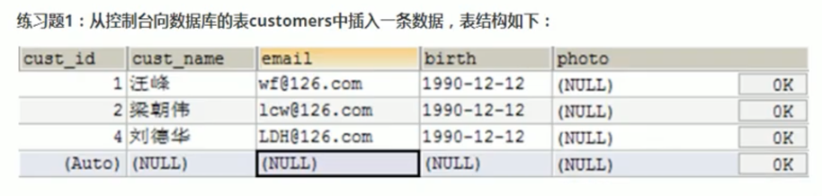

# 3.6 JDBC API小结

- 两种思想
    - 面向接口编程的思想
    - ORM思想(Object Relational Mapping)
        - 一个数据表对应一个Java类
        - 表中的一条记录对应Java类的一个对象
        - 表中的一个字段对应Java类的一个属性

> SQL是需要结合列明和类的属性名来写，注意起别名。

- 两种技术
    - JDBC结果集的元数据: ResultSetMetaData
        - 获取列数: getColumnCount()
        - 获取列的别名: getColumnLabel()
    - 通过反射，创建指定类的对象，获取指定的属性并赋值

# 章节练习




- 对于如下异常，需要在`my.ini`配置文件中加上`[mysqld] max_allowed_packet=16M`
  

## 事务的ACID属性及4种隔离级别


### 6.3.3 在MySql中设置隔离级别

- 每启动一个mysql程序，就会获得一个单独的数据库连接，每个数据库连接都有一个全局变量`@@transaction_isolation`，表示当前的事务隔离级别。
- 查看当前的隔离级别: `select @@transaction_isolation;`
- 设置当前mysql连接的隔离级别: `set transaction isolation level read committed;`
- 设置数据库系统的全局隔离级别: `set global transaction isolation level read committed;`
- 补充操作
    - 创建mysql数据库用户: `create user tom identified by '123456';`
    - 授予权限: `grant select, insert, update, delete on test.* to tom@localhost;`

# 3.6 JDBC总复习

## 01-JDBC概述

### 1. 数据的持久化

持久化(persistence)，**把数据保存到可掉电式存储设备中以供之后使用**。

### 2. JDBC的理解

JDBC(Java Database Connectivity)是一个**独立于特定数据库管理系统、通用的SQL数据库存储和操作的公共接口**(一组API)。
简单理解为: JDBC，是SUN提供的一套API，使用这套API可以实现对具体数据库的操作(获取连接、关闭连接、DML、DDL、DCL)。

### 3. 图示理解


好处:

- **面向应用的API**: Java API，抽象接口，供应用程序开发人员使用(连接数据库，执行SQL语句，获得结果)。
- **面向数据库的API**: Java Driver API，供开发商开发数据库驱动程序用。

> 从开发程序员的角度: 不需要关注具体的数据库的细节。  
> 数据库厂商: 只需要提供标准的具体实现。

### 4. 数据库的驱动

数据库厂商针对于JDBC这套接口，提供的具体实现类的集合。

类似:


### 5. 面向接口编程的思想

JDBC是sun公司提供的一套关于数据库操作的接口，java程序员只需要面向这套接口编程即可。  
不同的数据库厂商，需要针对这套接口，提供不同的实现。不同的实现的集合，即为不同数据库的驱动。

## 02-数据库的连接

方式一、方式二、方式三、方式四: 作为过程存在，了解即可。

方式五: **最终版**

```java

@Test
public void getConnection5() throws Exception {
    // 1. 读取配置文件中的4个基本信息
    InputStream is = ConnectionTest.class.getClassLoader().getResourceAsStream("jdbc.properties");

    Properties props = new Properties();
    props.load(is);

    String user = props.getProperty("user");
    String password = props.getProperty("password");
    String url = props.getProperty("url");
    String driverClass = props.getProperty("driverClass");

    // 2. 加载驱动
    Class.forName(driverClass);

    // 3. 获取连接
    Connection conn = DriverManager.getConnection(url, user, password);
    System.out.println(conn);
}
```

其中，配置文件[jdbc.properties]: 此配置文件声明在`src/main/resources`下:

```properties
user=root
password=445566hh
url=jdbc:mysql://localhost:3306/jdbc_learn?readBatchedStatements=true
driverClass=com.mysql.cj.jdbc.Driver
```

```java
public class JDBCUtils {

    /**
     * 获取数据库的连接
     *
     * @return
     * @throws Exception
     */
    public static Connection getConnection() throws Exception {
        // 1. 读取配置文件中的4个基本信息
        InputStream is = ClassLoader.getSystemClassLoader().getResourceAsStream("jdbc.properties");

        Properties props = new Properties();
        props.load(is);

        String user = props.getProperty("user");
        String password = props.getProperty("password");
        String url = props.getProperty("url");
        String driverClass = props.getProperty("driverClass");

        // 2. 加载驱动
        Class.forName(driverClass);

        // 3. 获取连接
        Connection conn = DriverManager.getConnection(url, user, password);
        return conn;
    }

    /**
     * 关闭资源的操作
     *
     * @param conn
     * @param ps
     */
    public static void closeResource(Connection conn, Statement ps) {
        try {
            if (ps != null)
                ps.close();
        } catch (SQLException e) {
            e.printStackTrace();
        }

        try {
            if (conn != null)
                conn.close();
        } catch (SQLException e) {
            e.printStackTrace();
        }
    }

    /**
     * 关闭资源的操作
     *
     * @param conn
     * @param ps
     * @param rs
     */
    public static void closeResource(Connection conn, Statement ps, ResultSet rs) {
        try {
            if (rs != null)
                rs.close();
        } catch (SQLException e) {
            e.printStackTrace();
        }

        try {
            if (ps != null)
                ps.close();
        } catch (SQLException e) {
            e.printStackTrace();
        }

        try {
            if (conn != null)
                conn.close();
        } catch (SQLException e) {
            e.printStackTrace();
        }
    }
}

```

## 03-Statement接口实现CRUD操作(了解)

弊端:

- 问题一: 存在拼串操作，繁琐
- 问题二: 存在SQL注入问题

> SQL注入是利用某些系统没有对用户输入的数据进行充分的检查，而用户在输入数据时注入非法的SQL语句段或命令，  
> 从而利用系统的SQL引擎完成恶意行为的做法。

其他问题:

- Statement没办法操作Blob类型的变量。
- Statement实现批量插入时，效率较低。

## 04-PreparedStatement替换Statement实现CRUD操作

### 1. PreparedStatement的理解

1. PreparedStatement是Statement的子接口。
1. An object that represents a **precompiled** SQL statement.
1. 可以解决Statement的sql注入问题、拼串问题。

### 2. 使用PreparedStatement实现通用的增、删、改的方法: Version 1.0

```java
// 通用的增删改操作
public void update(String sql, Object... args) { // sql中占位符的个数与可变形参的长度相同
    Connection conn = null;
    PreparedStatement ps = null;
    try {
        // 1. 获取数据库的连接
        conn = JDBCUtils.getConnection();
        // 2. 预编译sql语句，返回PreparedStatement的实例
        ps = conn.prepareStatement(sql);
        // 3. 填充占位符
        for (int i = 0; i < args.length; i++) {
            ps.setObject(i + 1, args[i]); // 小心参数声明错误
        }
        // 4. 执行
        ps.execute();
    } catch (Exception e) {
        e.printStackTrace();
    } finally {
        // 5. 资源的关闭
        JDBCUtils.closeResource(conn, ps);
    }
}
```

### 3. 使用PreparedStatement实现通用的查询操作: Version 1.0

```java
public <T> T getInstance(Class<T> clazz, String sql, Object... args) {
    Connection conn = null;
    PreparedStatement ps = null;
    ResultSet rs = null;
    try {
        conn = JDBCUtils.getConnection();

        ps = conn.prepareStatement(sql);
        for (int i = 0; i < args.length; i++) {
            ps.setObject(i + 1, args[i]);
        }

        rs = ps.executeQuery();
        // 获取结果集的元数据: ResultSetMetaData
        ResultSetMetaData rsmd = rs.getMetaData();
        // 通过ResultSetMetaData获取结果集中的列数
        int columnCount = rsmd.getColumnCount();
        if (rs.next()) {
            T t = clazz.newInstance();
            // 处理结果集一行数据中的每一个列
            for (int i = 0; i < columnCount; i++) {
                // 获取列值
                Object columnValue = rs.getObject(i + 1);

                // 获取每个列的列名
                // String columnName = rsmd.getColumnName(i + 1);
                String columnLabel = rsmd.getColumnLabel(i + 1);

                // 给cust对象指定的columnName属性，赋值为columnValue，通过反射
                Field field = clazz.getDeclaredField(columnLabel);
                field.setAccessible(true);
                field.set(t, columnValue);
            }
            return t;
        }
    } catch (Exception e) {
        e.printStackTrace();
    } finally {
        JDBCUtils.closeResource(conn, ps, rs);
    }
    return null;
}

public <T> List<T> getForList(Class<T> clazz, String sql, Object... args) {

    Connection conn = null;
    PreparedStatement ps = null;
    ResultSet rs = null;
    try {
        conn = JDBCUtils.getConnection();

        ps = conn.prepareStatement(sql);
        for (int i = 0; i < args.length; i++) {
            ps.setObject(i + 1, args[i]);
        }

        rs = ps.executeQuery();
        // 获取结果集的元数据: ResultSetMetaData
        ResultSetMetaData rsmd = rs.getMetaData();
        // 通过ResultSetMetaData获取结果集中的列数
        int columnCount = rsmd.getColumnCount();
        // 创建集合对象
        ArrayList<T> list = new ArrayList<>();
        while (rs.next()) {
            T t = clazz.newInstance();
            // 处理结果集一行数据中的每一个列: 给t对象指定的属性赋值
            for (int i = 0; i < columnCount; i++) {
                // 获取列值
                Object columnValue = rs.getObject(i + 1);

                // 获取每个列的列名
                String columnLabel = rsmd.getColumnLabel(i + 1);

                // 给cust对象指定的columnName属性，赋值为columnValue，通过反射
                Field field = clazz.getDeclaredField(columnLabel);
                field.setAccessible(true);
                field.set(t, columnValue);
            }
            list.add(t);
        }
        return list;
    } catch (Exception e) {
        e.printStackTrace();
    } finally {
        JDBCUtils.closeResource(conn, ps, rs);
    }
    return null;
}
```

[总结]:

两种思想:

- 面向接口编程的思想
- ORM编程思想
    - 一个数据表对应一个Java类
    - 表中的一条记录对应Java类的一个对象
    - 表中的一个字段对应Java类的一个属性

两种技术:

- 使用结果集的元数据: ResultSetMetaData
    - getColumnCount(): 获取列数
    - getColumnLabel(): 获取列的别名(如果sql中每个字段取别名，getColumnLabel()获取的就是列名)

- 反射的使用
    1. 创建对应的运行时类的对象。
    1. 在运行时，动态地调用指定的运行时类的属性、方法。

查询的图示:


## 05-PreparedStatement操作Blob类型的变量

PreparedStatement可以操作Blob类型的变量

- 写入操作的方法: `ps.setBlob(InputStream is);`
- 读取操作的方法: `Blob blob = rs.getBlob(int idex); InputStream is = blob.getBinaryStream();`

具体的insert:

```java
// 向数据表customers中插入Blob类型的字段
@Test
public void testInsert() throws Exception {
    Connection conn = JDBCUtils.getConnection();

    String sql = "insert into customers(name, email, birth, photo) values(?, ?, ?, ?)";
    PreparedStatement ps = conn.prepareStatement(sql);

    ps.setObject(1, "狗狗");
    ps.setObject(2, "dog@123.com");
    ps.setObject(3, "2025-05-11");
    FileInputStream is = new FileInputStream(new File("src/main/resources/images/dog.png"));
    ps.setBlob(4, is);

    ps.execute();

    JDBCUtils.closeResource(conn, ps);
}
```

具体的query:

```java
// 查询数据表customers中Blob类型的数据
@Test
public void testQuery() {
    Connection conn = null;
    PreparedStatement ps = null;
    InputStream is = null;
    FileOutputStream fos = null;
    ResultSet rs = null;
    try {
        conn = JDBCUtils.getConnection();
        String sql = "select id, name, email, birth, photo from customers where id = ?";
        ps = conn.prepareStatement(sql);

        ps.setInt(1, 21);
        rs = ps.executeQuery();
        if (rs.next()) {
            // 方式1:
            /*
            int id = rs.getInt(1);
            String name = rs.getString(2);
            String email = rs.getString(3);
            Date birth = rs.getDate(4);
             */
            // 方式2:
            int id = rs.getInt("id");
            String name = rs.getString("name");
            String email = rs.getString("email");
            Date birth = rs.getDate("birth");

            Customer cust = new Customer(id, name, email, birth);
            System.out.println(cust);

            // 将Blob类型的字段下载下来，以文件的方式保存在本地
            Blob photo = rs.getBlob("photo");
            is = photo.getBinaryStream();

            fos = new FileOutputStream("shk2.png");
            byte[] buffer = new byte[1024];
            int len;
            while ((len = is.read(buffer)) != -1) {
                fos.write(buffer, 0, len);
            }
        }
    } catch (Exception e) {
        e.printStackTrace();
    } finally {
        try {
            if (is != null)
                is.close();
        } catch (IOException e) {
            e.printStackTrace();
        }
        try {
            if (fos != null)
                fos.close();
        } catch (IOException e) {
            e.printStackTrace();
        }
        JDBCUtils.closeResource(conn, ps, rs);
    }
}
```

注意:


## 06-PreparedStatement实现高效的批量插入

- 层次一: 使用Statement实现

```java
/*
Connection conn = JDBCUtils.getConnection();
Statement st = conn.createStateement();
for(int i = 1; i <=20000;i++) {
String sql = "insert into goods(name) values('name_" + i + "')";
    st.execute(sql);
}
*/
```

- 层次二: 使用PreparedStatement替换Statement
略
- 层次三:
    1. addBatch() / executeBatch() / clearBatch()
    1. mysql服务器默认是关闭批处理的，我们需要通过一个参数，让mysql开启批处理的支持。`?rewriteBatchedStatements=true`
       写在配置文件的url后面。
    1. 使用更新的mysql驱动。
- 层次四: 设置连接不允许自动提交数据。
```java
// 查询数据表customers中Blob类型的数据
@Test
public void testQuery() {
    Connection conn = null;
    PreparedStatement ps = null;
    InputStream is = null;
    FileOutputStream fos = null;
    ResultSet rs = null;
    try {
        conn = JDBCUtils.getConnection();
        String sql = "select id, name, email, birth, photo from customers where id = ?";
        ps = conn.prepareStatement(sql);

        ps.setInt(1, 21);
        rs = ps.executeQuery();
        if (rs.next()) {
            // 方式1:
            /*
            int id = rs.getInt(1);
            String name = rs.getString(2);
            String email = rs.getString(3);
            Date birth = rs.getDate(4);
             */
            // 方式2:
            int id = rs.getInt("id");
            String name = rs.getString("name");
            String email = rs.getString("email");
            Date birth = rs.getDate("birth");

            Customer cust = new Customer(id, name, email, birth);
            System.out.println(cust);

            // 将Blob类型的字段下载下来，以文件的方式保存在本地
            Blob photo = rs.getBlob("photo");
            is = photo.getBinaryStream();

            fos = new FileOutputStream("shk2.png");
            byte[] buffer = new byte[1024];
            int len;
            while ((len = is.read(buffer)) != -1) {
                fos.write(buffer, 0, len);
            }
        }
    } catch (Exception e) {
        e.printStackTrace();
    } finally {
        try {
            if (is != null)
                is.close();
        } catch (IOException e) {
            e.printStackTrace();
        }
        try {
            if (fos != null)
                fos.close();
        } catch (IOException e) {
            e.printStackTrace();
        }
        JDBCUtils.closeResource(conn, ps, rs);
    }
}
```

总结: PreparedStatement与Statement的异同?

1. 指出二者的关系? 接口与子接口的关系。
1. 开发中，PreparedStatement替换Statement。
1. An object that represents a precompiled 


