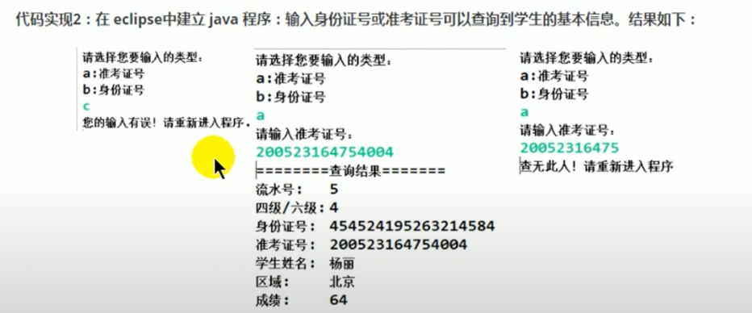

# 3.6 JDBC API小结

- 两种思想
    - 面向接口编程的思想
    - ORM思想(Object Relational Mapping)
        - 一个数据表对应一个Java类
        - 表中的一条记录对应Java类的一个对象
        - 表中的一个字段对应Java类的一个属性

> SQL是需要结合列明和类的属性名来写，注意起别名。

- 两种技术
    - JDBC结果集的元数据: ResultSetMetaData
        - 获取列数: getColumnCount()
        - 获取列的别名: getColumnLabel()
    - 通过反射，创建指定类的对象，获取指定的属性并赋值

# 章节练习

- 对于如下异常，需要在`my.ini`配置文件中加上`[mysqld] max_allowed_packet=10M`
