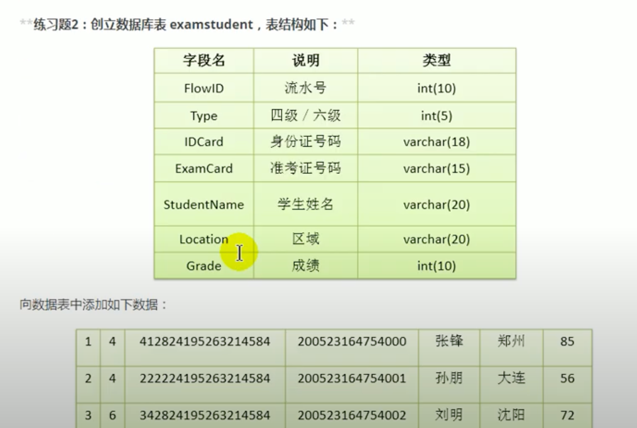
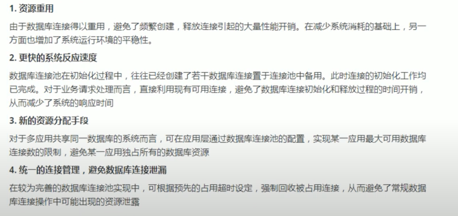

# 3.6 JDBC API小结

- 两种思想
    - 面向接口编程的思想
    - ORM思想(Object Relational Mapping)
        - 一个数据表对应一个Java类
        - 表中的一条记录对应Java类的一个对象
        - 表中的一个字段对应Java类的一个属性

> SQL是需要结合列明和类的属性名来写，注意起别名。

- 两种技术
    - JDBC结果集的元数据: ResultSetMetaData
        - 获取列数: getColumnCount()
        - 获取列的别名: getColumnLabel()
    - 通过反射，创建指定类的对象，获取指定的属性并赋值

# 章节练习





- 对于如下异常，需要在`my.ini`配置文件中加上`[mysqld] max_allowed_packet=16M`
  

## 事务的ACID属性及4种隔离级别


### 6.3.3 在MySql中设置隔离级别

- 每启动一个mysql程序，就会获得一个单独的数据库连接，每个数据库连接都有一个全局变量`@@transaction_isolation`，表示当前的事务隔离级别。
- 查看当前的隔离级别: `select @@transaction_isolation;`
- 设置当前mysql连接的隔离级别: `set transaction isolation level read committed;`
- 设置数据库系统的全局隔离级别: `set global transaction isolation level read committed;`
- 补充操作
    - 创建mysql数据库用户: `create user tom identified by '123456';`
    - 授予权限: `grant select, insert, update, delete on test.* to tom@localhost;`

# 3.6 JDBC总复习

## 01-JDBC概述

### 1. 数据的持久化

持久化(persistence)，**把数据保存到可掉电式存储设备中以供之后使用**。

### 2. JDBC的理解

JDBC(Java Database Connectivity)是一个**独立于特定数据库管理系统、通用的SQL数据库存储和操作的公共接口**(一组API)。
简单理解为: JDBC，是SUN提供的一套API，使用这套API可以实现对具体数据库的操作(获取连接、关闭连接、DML、DDL、DCL)。

### 3. 图示理解


好处:

- **面向应用的API**: Java API，抽象接口，供应用程序开发人员使用(连接数据库，执行SQL语句，获得结果)。
- **面向数据库的API**: Java Driver API，供开发商开发数据库驱动程序用。

> 从开发程序员的角度: 不需要关注具体的数据库的细节。  
> 数据库厂商: 只需要提供标准的具体实现。

### 4. 数据库的驱动

数据库厂商针对于JDBC这套接口，提供的具体实现类的集合。

类似:


### 5. 面向接口编程的思想

JDBC是sun公司提供的一套关于数据库操作的接口，java程序员只需要面向这套接口编程即可。  
不同的数据库厂商，需要针对这套接口，提供不同的实现。不同的实现的集合，即为不同数据库的驱动。

## 02-数据库的连接

方式一、方式二、方式三、方式四: 作为过程存在，了解即可。

方式五: **最终版**

```java

@Test
public void getConnection5() throws Exception {
    // 1. 读取配置文件中的4个基本信息
    InputStream is = ConnectionTest.class.getClassLoader().getResourceAsStream("jdbc.properties");

    Properties props = new Properties();
    props.load(is);

    String user = props.getProperty("user");
    String password = props.getProperty("password");
    String url = props.getProperty("url");
    String driverClass = props.getProperty("driverClass");

    // 2. 加载驱动
    Class.forName(driverClass);

    // 3. 获取连接
    Connection conn = DriverManager.getConnection(url, user, password);
    System.out.println(conn);
}
```

其中，配置文件[jdbc.properties]: 此配置文件声明在`src/main/resources`下:

```properties
user=root
password=445566hh
url=jdbc:mysql://localhost:3306/jdbc_learn?readBatchedStatements=true
driverClass=com.mysql.cj.jdbc.Driver
```

```java
public class JDBCUtils {

    /**
     * 获取数据库的连接
     *
     * @return
     * @throws Exception
     */
    public static Connection getConnection() throws Exception {
        // 1. 读取配置文件中的4个基本信息
        InputStream is = ClassLoader.getSystemClassLoader().getResourceAsStream("jdbc.properties");

        Properties props = new Properties();
        props.load(is);

        String user = props.getProperty("user");
        String password = props.getProperty("password");
        String url = props.getProperty("url");
        String driverClass = props.getProperty("driverClass");

        // 2. 加载驱动
        Class.forName(driverClass);

        // 3. 获取连接
        Connection conn = DriverManager.getConnection(url, user, password);
        return conn;
    }

    /**
     * 关闭资源的操作
     *
     * @param conn
     * @param ps
     */
    public static void closeResource(Connection conn, Statement ps) {
        try {
            if (ps != null)
                ps.close();
        } catch (SQLException e) {
            e.printStackTrace();
        }

        try {
            if (conn != null)
                conn.close();
        } catch (SQLException e) {
            e.printStackTrace();
        }
    }

    /**
     * 关闭资源的操作
     *
     * @param conn
     * @param ps
     * @param rs
     */
    public static void closeResource(Connection conn, Statement ps, ResultSet rs) {
        try {
            if (rs != null)
                rs.close();
        } catch (SQLException e) {
            e.printStackTrace();
        }

        try {
            if (ps != null)
                ps.close();
        } catch (SQLException e) {
            e.printStackTrace();
        }

        try {
            if (conn != null)
                conn.close();
        } catch (SQLException e) {
            e.printStackTrace();
        }
    }
}

```

## 03-Statement接口实现CRUD操作(了解)

弊端:

- 问题一: 存在拼串操作，繁琐
- 问题二: 存在SQL注入问题

> SQL注入是利用某些系统没有对用户输入的数据进行充分的检查，而用户在输入数据时注入非法的SQL语句段或命令，  
> 从而利用系统的SQL引擎完成恶意行为的做法。

其他问题:

- Statement没办法操作Blob类型的变量。
- Statement实现批量插入时，效率较低。

## 04-PreparedStatement替换Statement实现CRUD操作

### 1. PreparedStatement的理解

1. PreparedStatement是Statement的子接口。
1. An object that represents a **precompiled** SQL statement.
1. 可以解决Statement的sql注入问题、拼串问题。

### 2. 使用PreparedStatement实现通用的增、删、改的方法: Version 1.0

```java
// 通用的增删改操作
public void update(String sql, Object... args) { // sql中占位符的个数与可变形参的长度相同
    Connection conn = null;
    PreparedStatement ps = null;
    try {
        // 1. 获取数据库的连接
        conn = JDBCUtils.getConnection();
        // 2. 预编译sql语句，返回PreparedStatement的实例
        ps = conn.prepareStatement(sql);
        // 3. 填充占位符
        for (int i = 0; i < args.length; i++) {
            ps.setObject(i + 1, args[i]); // 小心参数声明错误
        }
        // 4. 执行
        ps.execute();
    } catch (Exception e) {
        e.printStackTrace();
    } finally {
        // 5. 资源的关闭
        JDBCUtils.closeResource(conn, ps);
    }
}
```

### 3. 使用PreparedStatement实现通用的查询操作: Version 1.0

```java
public <T> T getInstance(Class<T> clazz, String sql, Object... args) {
    Connection conn = null;
    PreparedStatement ps = null;
    ResultSet rs = null;
    try {
        conn = JDBCUtils.getConnection();

        ps = conn.prepareStatement(sql);
        for (int i = 0; i < args.length; i++) {
            ps.setObject(i + 1, args[i]);
        }

        rs = ps.executeQuery();
        // 获取结果集的元数据: ResultSetMetaData
        ResultSetMetaData rsmd = rs.getMetaData();
        // 通过ResultSetMetaData获取结果集中的列数
        int columnCount = rsmd.getColumnCount();
        if (rs.next()) {
            T t = clazz.newInstance();
            // 处理结果集一行数据中的每一个列
            for (int i = 0; i < columnCount; i++) {
                // 获取列值
                Object columnValue = rs.getObject(i + 1);

                // 获取每个列的列名
                // String columnName = rsmd.getColumnName(i + 1);
                String columnLabel = rsmd.getColumnLabel(i + 1);

                // 给cust对象指定的columnName属性，赋值为columnValue，通过反射
                Field field = clazz.getDeclaredField(columnLabel);
                field.setAccessible(true);
                field.set(t, columnValue);
            }
            return t;
        }
    } catch (Exception e) {
        e.printStackTrace();
    } finally {
        JDBCUtils.closeResource(conn, ps, rs);
    }
    return null;
}

public <T> List<T> getForList(Class<T> clazz, String sql, Object... args) {

    Connection conn = null;
    PreparedStatement ps = null;
    ResultSet rs = null;
    try {
        conn = JDBCUtils.getConnection();

        ps = conn.prepareStatement(sql);
        for (int i = 0; i < args.length; i++) {
            ps.setObject(i + 1, args[i]);
        }

        rs = ps.executeQuery();
        // 获取结果集的元数据: ResultSetMetaData
        ResultSetMetaData rsmd = rs.getMetaData();
        // 通过ResultSetMetaData获取结果集中的列数
        int columnCount = rsmd.getColumnCount();
        // 创建集合对象
        ArrayList<T> list = new ArrayList<>();
        while (rs.next()) {
            T t = clazz.newInstance();
            // 处理结果集一行数据中的每一个列: 给t对象指定的属性赋值
            for (int i = 0; i < columnCount; i++) {
                // 获取列值
                Object columnValue = rs.getObject(i + 1);

                // 获取每个列的列名
                String columnLabel = rsmd.getColumnLabel(i + 1);

                // 给cust对象指定的columnName属性，赋值为columnValue，通过反射
                Field field = clazz.getDeclaredField(columnLabel);
                field.setAccessible(true);
                field.set(t, columnValue);
            }
            list.add(t);
        }
        return list;
    } catch (Exception e) {
        e.printStackTrace();
    } finally {
        JDBCUtils.closeResource(conn, ps, rs);
    }
    return null;
}
```

[总结]:

两种思想:

- 面向接口编程的思想
- ORM编程思想
    - 一个数据表对应一个Java类
    - 表中的一条记录对应Java类的一个对象
    - 表中的一个字段对应Java类的一个属性

两种技术:

- 使用结果集的元数据: ResultSetMetaData
    - getColumnCount(): 获取列数
    - getColumnLabel(): 获取列的别名(如果sql中每个字段取别名，getColumnLabel()获取的就是列名)

- 反射的使用
    1. 创建对应的运行时类的对象。
    1. 在运行时，动态地调用指定的运行时类的属性、方法。

查询的图示:


## 05-PreparedStatement操作Blob类型的变量

PreparedStatement可以操作Blob类型的变量

- 写入操作的方法: `ps.setBlob(InputStream is);`
- 读取操作的方法: `Blob blob = rs.getBlob(int idex); InputStream is = blob.getBinaryStream();`

具体的insert:

```java
// 向数据表customers中插入Blob类型的字段
@Test
public void testInsert() throws Exception {
    Connection conn = JDBCUtils.getConnection();

    String sql = "insert into customers(name, email, birth, photo) values(?, ?, ?, ?)";
    PreparedStatement ps = conn.prepareStatement(sql);

    ps.setObject(1, "狗狗");
    ps.setObject(2, "dog@123.com");
    ps.setObject(3, "2025-05-11");
    FileInputStream is = new FileInputStream(new File("src/main/resources/images/dog.png"));
    ps.setBlob(4, is);

    ps.execute();

    JDBCUtils.closeResource(conn, ps);
}
```

具体的query:

```java
// 查询数据表customers中Blob类型的数据
@Test
public void testQuery() {
    Connection conn = null;
    PreparedStatement ps = null;
    InputStream is = null;
    FileOutputStream fos = null;
    ResultSet rs = null;
    try {
        conn = JDBCUtils.getConnection();
        String sql = "select id, name, email, birth, photo from customers where id = ?";
        ps = conn.prepareStatement(sql);

        ps.setInt(1, 21);
        rs = ps.executeQuery();
        if (rs.next()) {
            // 方式1:
            /*
            int id = rs.getInt(1);
            String name = rs.getString(2);
            String email = rs.getString(3);
            Date birth = rs.getDate(4);
             */
            // 方式2:
            int id = rs.getInt("id");
            String name = rs.getString("name");
            String email = rs.getString("email");
            Date birth = rs.getDate("birth");

            Customer cust = new Customer(id, name, email, birth);
            System.out.println(cust);

            // 将Blob类型的字段下载下来，以文件的方式保存在本地
            Blob photo = rs.getBlob("photo");
            is = photo.getBinaryStream();

            fos = new FileOutputStream("shk2.png");
            byte[] buffer = new byte[1024];
            int len;
            while ((len = is.read(buffer)) != -1) {
                fos.write(buffer, 0, len);
            }
        }
    } catch (Exception e) {
        e.printStackTrace();
    } finally {
        try {
            if (is != null)
                is.close();
        } catch (IOException e) {
            e.printStackTrace();
        }
        try {
            if (fos != null)
                fos.close();
        } catch (IOException e) {
            e.printStackTrace();
        }
        JDBCUtils.closeResource(conn, ps, rs);
    }
}
```

注意:


## 06-PreparedStatement实现高效的批量插入

- 层次一: 使用Statement实现

```java
/*
Connection conn = JDBCUtils.getConnection();
Statement st = conn.createStateement();
for(int i = 1; i <=20000;i++) {
String sql = "insert into goods(name) values('name_" + i + "')";
    st.execute(sql);
}
*/
```

- 层次二: 使用PreparedStatement替换Statement
  略
- 层次三:
    1. addBatch() / executeBatch() / clearBatch()
    1. mysql服务器默认是关闭批处理的，我们需要通过一个参数，让mysql开启批处理的支持。`?rewriteBatchedStatements=true`
       写在配置文件的url后面。
    1. 使用更新的mysql驱动。
- 层次四: 设置连接不允许自动提交数据。

```java
// 查询数据表customers中Blob类型的数据
@Test
public void testQuery() {
    Connection conn = null;
    PreparedStatement ps = null;
    InputStream is = null;
    FileOutputStream fos = null;
    ResultSet rs = null;
    try {
        conn = JDBCUtils.getConnection();
        String sql = "select id, name, email, birth, photo from customers where id = ?";
        ps = conn.prepareStatement(sql);

        ps.setInt(1, 21);
        rs = ps.executeQuery();
        if (rs.next()) {
            // 方式1:
            /*
            int id = rs.getInt(1);
            String name = rs.getString(2);
            String email = rs.getString(3);
            Date birth = rs.getDate(4);
             */
            // 方式2:
            int id = rs.getInt("id");
            String name = rs.getString("name");
            String email = rs.getString("email");
            Date birth = rs.getDate("birth");

            Customer cust = new Customer(id, name, email, birth);
            System.out.println(cust);

            // 将Blob类型的字段下载下来，以文件的方式保存在本地
            Blob photo = rs.getBlob("photo");
            is = photo.getBinaryStream();

            fos = new FileOutputStream("shk2.png");
            byte[] buffer = new byte[1024];
            int len;
            while ((len = is.read(buffer)) != -1) {
                fos.write(buffer, 0, len);
            }
        }
    } catch (Exception e) {
        e.printStackTrace();
    } finally {
        try {
            if (is != null)
                is.close();
        } catch (IOException e) {
            e.printStackTrace();
        }
        try {
            if (fos != null)
                fos.close();
        } catch (IOException e) {
            e.printStackTrace();
        }
        JDBCUtils.closeResource(conn, ps, rs);
    }
}
```

总结: PreparedStatement与Statement的异同?

1. 指出二者的关系? 接口与子接口的关系。
1. 开发中，PreparedStatement替换Statement。
1. An object that represents a precompiled


## 07-数据库的事务

### 1. 事务

一组逻辑操作单元，使数据从一种状态变换到两一种状态。  
一组逻辑操作单元: 一个或多个DML操作。

### 2. 事务处理的原则

保证所有事务都作为一个工作单元来执行，即使出现了故障，都不能改变这种执行方式。

- 当在一个事务中执行多个操作时，要么所有的事务都提交(commit)，那么这些修改就永久地被保存下来。
- 要么数据库管理系统将放弃所做的所有修改，整个事务回滚(rollback)到最初状态。

说明:

1. 数据一旦提交，就不可回滚。
1. 哪些操作会导致数据的自动提交?
    - DDL操作一旦执行，都会自动提交。
        - set autocommit = false 对DDL操作生效。
    - DML默认情况下，一旦执行，就会自动提交。
        - 我们可以通过set autocommit = false的方式取消DML操作的自动提交。
    - 默认在关闭连接时，会自动地提交数据。

### 3. 代码的体现

```java

@Test
public void testUpdateWithTx() {
    Connection conn = null;
    try {
        conn = JDBCUtils.getConnection();

        System.out.println(conn.getAutoCommit());
        // 1. 取消数据的自动提交
        conn.setAutoCommit(false);

        String sql1 = "update user_table set balance = balance - 100 where user = ?";
        update(conn, sql1, "AA");

        // 模拟网络异常
        System.out.println(10 / 0);

        String sql2 = "update user_table set balance = balance + 100 where user = ?";
        update(conn, sql2, "BB");

        // 2. 提交数据
        conn.commit();
        System.out.println("转账成功");
    } catch (Exception e) {
        e.printStackTrace();
        try {
            // 3. 回滚数据
            conn.rollback();
        } catch (SQLException ex) {
            e.printStackTrace();
        }
    } finally {
        try {
            // 恢复其为自动提交数据
            // 主要针对于使用数据库连接池的使用
            conn.setAutoCommit(true);
        } catch (SQLException e) {
            e.printStackTrace();
        }
        JDBCUtils.closeResource(conn, null);
    }
}
```

### 4. 考虑到事务以后，实现的通用的增删改操作: version 2.0

```java
// 通用的增删改操作 -- version2.0 (考虑上事务)
public int update(Connection conn, String sql, Object... args) { // sql中占位符的个数与可变形参的长度相同
    PreparedStatement ps = null;
    try {
        // 1. 预编译sql语句，返回PreparedStatement的实例
        ps = conn.prepareStatement(sql);
        // 2. 填充占位符
        for (int i = 0; i < args.length; i++) {
            ps.setObject(i + 1, args[i]); // 小心参数声明错误
        }
        // 3. 执行
        ps.executeUpdate();
    } catch (Exception e) {
        e.printStackTrace();
    } finally {
        // 4. 资源的关闭
        JDBCUtils.closeResource(null, ps);
    }
    return 0;
}
```

考虑到事务以后，实现的通用的查询: version 2.0

```java
// 通用的查询操作，用于返回数据表中的一条记录(Version 2.0: 考虑上事务)
public <T> T getInstance(Connection conn, Class<T> clazz, String sql, Object... args) {
    PreparedStatement ps = null;
    ResultSet rs = null;
    try {

        ps = conn.prepareStatement(sql);
        for (int i = 0; i < args.length; i++) {
            ps.setObject(i + 1, args[i]);
        }

        rs = ps.executeQuery();
        // 获取结果集的元数据: ResultSetMetaData
        ResultSetMetaData rsmd = rs.getMetaData();
        // 通过ResultSetMetaData获取结果集中的列数
        int columnCount = rsmd.getColumnCount();
        if (rs.next()) {
            T t = clazz.newInstance();
            // 处理结果集一行数据中的每一个列
            for (int i = 0; i < columnCount; i++) {
                // 获取列值
                Object columnValue = rs.getObject(i + 1);

                // 获取每个列的列名
                // String columnName = rsmd.getColumnName(i + 1);
                String columnLabel = rsmd.getColumnLabel(i + 1);

                // 给cust对象指定的columnName属性，赋值为columnValue，通过反射
                Field field = clazz.getDeclaredField(columnLabel);
                field.setAccessible(true);
                field.set(t, columnValue);
            }
            return t;
        }
    } catch (Exception e) {
        e.printStackTrace();
    } finally {
        JDBCUtils.closeResource(null, ps, rs);
    }
    return null;
}
```

### 事务的属性

* 四大属性: ACID


* 数据操作过程中可能出现的问题 (针对隔离性)


* 数据库的四种隔离级别 (一致性和并发性: 一致性越好，并发性越差)


* 如何查看并设置隔离级别


`select @@transaction_isolation;`


## 08-DAO及其子类

```java
/**
 * ClassName: BaseDao
 * Package: com.atguigu.jdbc.k_dao_improved
 * Description:
 * DAO: Data(base) Access Object
 * 封装了针对于数据表的通用操作。
 *
 * @Author: ljy
 * @Create: 2025. 5. 19. 오전 10:10
 * @Version 1.0
 */
public abstract class BaseDAO<T> {

    private Class<T> clazz = null;

    // public BaseDAO() {
    // }

    {
        // 获取当前BaseDAO的子类继承的父类中的泛型
        Type genericSuperclass = this.getClass().getGenericSuperclass();
        ParameterizedType paramType = (ParameterizedType) genericSuperclass;

        Type[] typeArguments = paramType.getActualTypeArguments();// 获取了父类的泛型参数
        clazz = (Class<T>) typeArguments[0];// 泛型的第一个参数
    }


    // 通用的增删改操作 -- version2.0 (考虑上事务)
    public int update(Connection conn, String sql, Object... args) { // sql中占位符的个数与可变形参的长度相同
        PreparedStatement ps = null;
        try {
            // 1. 预编译sql语句，返回PreparedStatement的实例
            ps = conn.prepareStatement(sql);
            // 2. 填充占位符
            for (int i = 0; i < args.length; i++) {
                ps.setObject(i + 1, args[i]); // 小心参数声明错误
            }
            // 3. 执行
            ps.executeUpdate();
        } catch (Exception e) {
            e.printStackTrace();
        } finally {
            // 4. 资源的关闭
            JDBCUtils.closeResource(null, ps);
        }
        return 0;
    }

    // 通用的查询操作，用于返回数据表中的一条记录(Version 2.0: 考虑上事务)
    public T getInstance(Connection conn, String sql, Object... args) {
        PreparedStatement ps = null;
        ResultSet rs = null;
        try {

            ps = conn.prepareStatement(sql);
            for (int i = 0; i < args.length; i++) {
                ps.setObject(i + 1, args[i]);
            }

            rs = ps.executeQuery();
            // 获取结果集的元数据: ResultSetMetaData
            ResultSetMetaData rsmd = rs.getMetaData();
            // 通过ResultSetMetaData获取结果集中的列数
            int columnCount = rsmd.getColumnCount();
            if (rs.next()) {
                T t = clazz.newInstance();
                // 处理结果集一行数据中的每一个列
                for (int i = 0; i < columnCount; i++) {
                    // 获取列值
                    Object columnValue = rs.getObject(i + 1);

                    // 获取每个列的列名
                    String columnLabel = rsmd.getColumnLabel(i + 1);

                    // 给对象指定的columnName属性，赋值为columnValue，通过反射
                    Field field = clazz.getDeclaredField(columnLabel);
                    field.setAccessible(true);
                    field.set(t, columnValue);
                }
                return t;
            }
        } catch (Exception e) {
            e.printStackTrace();
        } finally {
            JDBCUtils.closeResource(null, ps, rs);
        }
        return null;
    }

    // 通用的查询操作，用于返回数据表中的多条记录构成的集合(Version 2.0: 考虑上事务)
    public List<T> getForList(Connection conn, String sql, Object... args) {
        PreparedStatement ps = null;
        ResultSet rs = null;
        try {
            ps = conn.prepareStatement(sql);
            for (int i = 0; i < args.length; i++) {
                ps.setObject(i + 1, args[i]);
            }

            rs = ps.executeQuery();
            // 获取结果集的元数据: ResultSetMetaData
            ResultSetMetaData rsmd = rs.getMetaData();
            // 通过ResultSetMetaData获取结果集中的列数
            int columnCount = rsmd.getColumnCount();
            // 创建集合对象
            ArrayList<T> list = new ArrayList<>();
            while (rs.next()) {
                T t = clazz.newInstance();
                // 处理结果集一行数据中的每一个列: 给t对象指定的属性赋值
                for (int i = 0; i < columnCount; i++) {
                    // 获取列值
                    Object columnValue = rs.getObject(i + 1);

                    // 获取每个列的列名
                    String columnLabel = rsmd.getColumnLabel(i + 1);

                    // 给cust对象指定的columnName属性，赋值为columnValue，通过反射
                    Field field = clazz.getDeclaredField(columnLabel);
                    field.setAccessible(true);
                    field.set(t, columnValue);
                }
                list.add(t);
            }
            return list;
        } catch (Exception e) {
            e.printStackTrace();
        } finally {
            JDBCUtils.closeResource(null, ps, rs);
        }
        return null;
    }

    // 用于查询特殊值的通用方法
    public <E> E getValue(Connection conn, String sql, Object... args) {
        PreparedStatement ps = null;
        ResultSet rs = null;
        try {
            ps = conn.prepareStatement(sql);
            for (int i = 0; i < args.length; i++) {
                ps.setObject(i + 1, args[i]);
            }

            rs = ps.executeQuery();
            if (rs.next()) {
                return (E) rs.getObject(1);
            }
        } catch (SQLException e) {
            e.printStackTrace();
        } finally {
            JDBCUtils.closeResource(null, ps, rs);
        }
        return null;
    }
}
```

```java
/**
 * ClassName: CustomerDAO
 * Package: com.atguigu.jdbc.k_dao_improved
 * Description:
 * 此接口用于规范针对于customers表的常用操作
 *
 * @Author: ljy
 * @Create: 2025. 5. 19. 오전 10:10
 * @Version 1.0
 */
public interface CustomerDAO {

    /**
     * 将cust对象添加到数据库中
     *
     * @param conn
     * @param cust
     */
    void insert(Connection conn, Customer cust);

    /**
     * 针对于指定的id，删除表中的一条记录
     *
     * @param conn
     * @param id
     */
    void deleteById(Connection conn, int id);

    /**
     * 针对内存中的cust对象，去修改数据表中指定的记录
     *
     * @param conn
     * @param cust
     */
    void updateById(Connection conn, Customer cust);

    /**
     * 针对于指定的id查询得到对应的Customer
     *
     * @param conn
     * @param id
     * @return
     */
    Customer getCustomerById(Connection conn, int id);

    /**
     * 查询表中的所有记录构成的集合
     *
     * @param conn
     * @return
     */
    List<Customer> getAll(Connection conn);

    /**
     * 返回数据表中数据的条目数
     *
     * @param conn
     * @return
     */
    Long getCount(Connection conn);

    /**
     * 返回数据表中最大的生日
     *
     * @param conn
     * @return
     */
    Date getMaxBirth(Connection conn);
}
```

```java
/**
 * ClassName: CustomDaoImpl
 * Package: com.atguigu.jdbc.k_dao_improved
 * Description:
 *
 * @Author: ljy
 * @Create: 2025. 5. 19. 오전 10:10
 * @Version 1.0
 */
public class CustomDAOImpl extends BaseDAO<Customer> implements CustomerDAO {
    @Override
    public void insert(Connection conn, Customer cust) {
        String sql = "insert into customers(name, email, birth) values(?, ?, ?)";
        update(conn, sql, cust.getName(), cust.getEmail(), cust.getBirth());
    }

    @Override
    public void deleteById(Connection conn, int id) {
        String sql = "delete from customers where id = ?";
        update(conn, sql, id);
    }

    @Override
    public void updateById(Connection conn, Customer cust) {
        String sql = "update customers set name = ?, email = ?, birth = ? where id = ?";
        update(conn, sql, cust.getName(), cust.getEmail(), cust.getBirth(), cust.getId());
    }

    @Override
    public Customer getCustomerById(Connection conn, int id) {
        String sql = "select id, name, email, birth from customers where id = ?";
        Customer customer = getInstance(conn, sql, id);
        return customer;
    }

    @Override
    public List<Customer> getAll(Connection conn) {
        String sql = "select id, name, birth from customers";
        List<Customer> list = getForList(conn, sql);
        return list;
    }

    @Override
    public Long getCount(Connection conn) {
        String sql = "select count(*) from customers";
        return getValue(conn, sql);
    }

    @Override
    public Date getMaxBirth(Connection conn) {
        String sql = "select max(birth) from customers";
        return getValue(conn, sql);
    }
}
```

总结: 考虑到事务以后到数据库操作(重点)

1. 获取数据库的连接   
   Connection conn = JDBCUtils.getConnection(); // 方式1: 手动获取连接 方式2: 数据库连接池  
   conn.setAutoCommit(false); // 体现事务
2. 如下的多个DML操作，作为一个事务出现:
   操作1: 需要使用通用的增删改查操作 // 通用的增删改查操作如何实现?  
   操作2: 需要使用通用的增删改查操作 // 方式1: 手动使用PreparedStatement实现  
   操作3: 需要使用通用的增删改查操作 // 方式2: 使用dbutils.jar中的QueryRunner类

conn.commit();

3. 如果出现异常，则:
   conn.rollback();

4. 关闭资源
   JDBCUtils.closeResource(..,..,..); // 方式1: 手动关闭资源 方式2: DbUtils类的关闭方法

## 09-数据库连接池

### 1. 传统连接的问题


### 2. 如何解决传统开发中的数据库连接问题

使用数据库连接池

### 3. 使用数据库连接池的好处



或自己组织语言:

1. 提供程序的响应速度(减少了创建连接响应的时间)
2. 降低资源的消耗(可以重复使用已经提供好的连接)
3. 便于连接的管理

### 4. 实现的方式


### C3P0

* 导入jar包

```xml

<dependency>
    <groupId>com.mchange</groupId>
    <artifactId>c3p0</artifactId>
    <version>0.9.5.2</version>
</dependency>
```

* 测试连接的代码

```java
/**
 * 使用C3P0的数据库连接池技术
 *
 * @return
 * @throws SQLException
 */
// 数据库连接池只需提供一个即可。
private static ComboPooledDataSource dataSouceC3P0 = new ComboPooledDataSource("helloc3p0");

public static Connection getConnection1() throws SQLException {
    Connection conn = dataSouceC3P0.getConnection();
    return conn;
}
```

其中，配置文件定义在`classpath`下，名为: `c3p0-config.xml`。

```xml
<?xml version="1.0" encoding="utf-8" ?>
<c3p0-config>
    <named-config name="helloc3p0">
        <!-- 提供获取连接的4个基本信息 -->
        <property name="driverClass">com.mysql.cj.jdbc.Driver</property>
        <property name="jdbcUrl">jdbc:mysql://localhost:3306/jdbc_learn</property>
        <property name="user">root</property>
        <property name="password">445566hh</property>

        <!-- 进行数据库连接池管理的基本信息 -->
        <!-- 当数据库连接池中的连接数不够时，c3p0一次性向数据库服务器申请的连接数 -->
        <property name="acquireIncrement">5</property>
        <!-- c3p0数据库连接池中初始化时的连接数 -->
        <property name="initialPoolSize">10</property>
        <!-- c3p0数据库连接池维护的最少的连接数 -->
        <property name="minPoolSize">10</property>
        <!-- c3p0数据库连接池维护的最多的连接数 -->
        <property name="maxPoolSize">100</property>
        <!-- c3p0数据库连接池最多维护的Statement的个数 -->
        <property name="maxStatements">50</property>
        <!-- 每个连接中最多可以使用的Statement的个数 -->
        <property name="maxStatementsPerConnection">2</property>
    </named-config>
</c3p0-config>
```

### DBCP

* 导入jar包

```xml

<dependency>
    <groupId>org.apache.commons</groupId>
    <artifactId>commons-dbcp2</artifactId>
    <version>2.9.0</version>
</dependency>
```

* 测试连接的代码

```java
/**
 * 使用DBCP数据库连接池技术获取数据库连接
 *
 * @return
 * @throws Exception
 */
// 创建一个DBCP数据库连接池

private static DataSource dataSourceDBCP;

static {
    try {
        Properties props = new Properties();
        FileInputStream is = new FileInputStream(new File("src/main/resources/dbcp.properties"));
        props.load(is);
        dataSourceDBCP = BasicDataSourceFactory.createDataSource(props);
    } catch (Exception e) {
        e.printStackTrace();
    }
}

public static Connection getConnection2() throws Exception {
    return dataSourceDBCP.getConnection();
}
```

其中，配置文件定义在`classpath`下: dbcp.properties

```properties
driverClassName=com.mysql.cj.jdbc.Driver
url=jdbc:mysql://localhost:3306/jdbc_learn
username=root
password=445566hh
initialSize=10
```

### DBCP

* 导入jar包

```xml

<dependency>
    <groupId>com.alibaba</groupId>
    <artifactId>druid</artifactId>
    <version>1.2.24</version>
</dependency>
```

* 测试连接的代码

```java
/**
 * 使用Druid数据库连接池技术
 */
private static DataSource dataSourceDruid;

static {
    try {
        Properties props = new Properties();

        InputStream is = ClassLoader.getSystemClassLoader().getResourceAsStream("druid.properties");
        props.load(is);
        dataSourceDruid = DruidDataSourceFactory.createDataSource(props);
    } catch (Exception e) {
        e.printStackTrace();
    }
}

public static Connection getConnection3() throws SQLException {
    return dataSourceDruid.getConnection();
}
```

其中，配置文件定义在`classpath`下: druid.properties

```properties
url=jdbc:mysql://localhost:3306/jdbc_learn
username=root
password=445566hh
driverClassName=com.mysql.cj.jdbc.Driver
initialSize=10
maxActive=10
```

## 10-DBUtils提供的jar包实现CRUD操作

* 导入jar包

```xml

<dependency>
    <groupId>commons-dbutils</groupId>
    <artifactId>commons-dbutils</artifactId>
    <version>1.7</version>
</dependency>
```

- 使用现成的jar中的QueryRunner测试增、删、改的操作

```java
// 测试插入
@Test
public void testInsert() throws SQLException {
    Connection conn = null;
    try {
        QueryRunner runner = new QueryRunner();

        conn = JDBCUtilsWithDataSource.getConnection3();
        String sql = "insert into customers(name, email, birth) values(?, ?, ?)";
        int insertCount = runner.update(conn, sql, "周阳", "zhouyang@126.com", "1973-05-19");
        System.out.println("添加了" + insertCount + "条记录");
    } catch (SQLException e) {
        e.printStackTrace();
    } finally {
        JDBCUtils.closeResource(conn, null);
    }
}
```

- 使用现成的jar中的QueryRunner测试查询的操作

```java
// 测试查询

/*
 BeanHandler: 是ResultSetHandler接口的实现类，用于封装表中的一条记录。
 */
@Test
public void testQuery1() {
    Connection conn = null;
    try {
        QueryRunner runner = new QueryRunner();
        conn = JDBCUtilsWithDataSource.getConnection3();
        String sql = "select id, name, email, birth from customers where id = ?";
        BeanHandler<Customer> handler = new BeanHandler<>(Customer.class);
        Customer customer = runner.query(conn, sql, handler, 21);
        System.out.println(customer);
    } catch (SQLException e) {
        e.printStackTrace();
    } finally {
        JDBCUtils.closeResource(conn, null);
    }
}

/*
 BeanListHandler: 是ResultSetHandler接口的实现类，用于封装表中的多条记录构成的集合。
 */
@Test
public void testQuery2() {
    Connection conn = null;
    try {
        QueryRunner runner = new QueryRunner();
        conn = JDBCUtilsWithDataSource.getConnection3();
        String sql = "select id, name, email, birth from customers where id < ?";
        BeanListHandler<Customer> handler = new BeanListHandler<>(Customer.class);
        List<Customer> list = runner.query(conn, sql, handler, 21);
        list.forEach(System.out::println);
    } catch (SQLException e) {
        e.printStackTrace();
    } finally {
        JDBCUtils.closeResource(conn, null);
    }
}

/*
 MapHandler: 是ResultSetHandler接口的实现类，对应表中的一条记录。
 将字段及相应字段的值作为map中的key和value。
 */
@Test
public void testQuery3() {
    Connection conn = null;
    try {
        QueryRunner runner = new QueryRunner();
        conn = JDBCUtilsWithDataSource.getConnection3();
        String sql = "select id, name, email, birth from customers where id = ?";
        MapHandler handler = new MapHandler();
        Map<String, Object> map = runner.query(conn, sql, handler, 21);
        System.out.println(map);
    } catch (SQLException e) {
        e.printStackTrace();
    } finally {
        JDBCUtils.closeResource(conn, null);
    }
}

/*
 MapListHandler: 是ResultSetHandler接口的实现类，对应表中的多条记录。
 将字段及相应字段的值作为map中的key和value，并将这些map添加到List中。
 */
@Test
public void testQuery4() {
    Connection conn = null;
    try {
        QueryRunner runner = new QueryRunner();
        conn = JDBCUtilsWithDataSource.getConnection3();
        String sql = "select id, name, email, birth from customers where id < ?";
        MapListHandler handler = new MapListHandler();
        List<Map<String, Object>> list = runner.query(conn, sql, handler, 20);
        list.forEach(System.out::println);
    } catch (SQLException e) {
        e.printStackTrace();
    } finally {
        JDBCUtils.closeResource(conn, null);
    }
}

/*
ScalarHandler: 用于查询特殊值。
 */
@Test
public void testQuery5() {
    Connection conn = null;
    try {
        QueryRunner runner = new QueryRunner();
        conn = JDBCUtilsWithDataSource.getConnection3();
        String sql = "select count(*) from customers";
        ScalarHandler handler = new ScalarHandler();
        Long count = (Long) runner.query(conn, sql, handler);
        System.out.println(count);
    } catch (SQLException e) {
        e.printStackTrace();
    } finally {
        JDBCUtils.closeResource(conn, null);
    }
}

@Test
public void testQuery6() {
    Connection conn = null;
    try {
        QueryRunner runner = new QueryRunner();
        conn = JDBCUtilsWithDataSource.getConnection3();
        String sql = "select max(birth) from customers";
        ScalarHandler handler = new ScalarHandler();
        Date maxBirth = (Date) runner.query(conn, sql, handler);
        System.out.println(maxBirth);
    } catch (SQLException e) {
        e.printStackTrace();
    } finally {
        JDBCUtils.closeResource(conn, null);
    }
}

/*
自定义ResultSetHandler的实现类
 */
@Test
public void testQuery7() {
    Connection conn = null;
    try {
        QueryRunner runner = new QueryRunner();
        conn = JDBCUtilsWithDataSource.getConnection3();
        String sql = "select id,name, email,birth from customers where id = ?";
        ResultSetHandler<Customer> handler = new ResultSetHandler<>() {

            @Override
            public Customer handle(ResultSet rs) throws SQLException {
                // System.out.println("handler");
                // return null;
                // return new Customer(12, "成龙", "jacky@126.com", new Date(1234567890L));
                // 下面的逻辑就相当于BeanHandler的处理过程
                if (rs.next()) {
                    int id = rs.getInt("id");
                    String name = rs.getString("name");
                    String email = rs.getString("email");
                    Date birth = rs.getDate("birth");
                    Customer customer = new Customer(id, name, email, birth);
                    return customer;
                }
                return null;
            }
        };
        Customer customer = runner.query(conn, sql, handler, 20);
        System.out.println(customer);
    } catch (SQLException e) {
        e.printStackTrace();
    } finally {
        JDBCUtils.closeResource(conn, null);
    }
}
```

使用`dbutils.jar`包中的`DbUtils`工具类实现连接等资源的关闭

```java
/**
 * 使用dbutils.jar中提供的DbUtils工具类，实现资源的关闭。
 *
 * @param conn
 * @param ps
 * @param rs
 */
public static void closeResource1(Connection conn, Statement ps, ResultSet rs) {
        /*
        try {
            DbUtils.close(conn);
        } catch (SQLException e) {
            e.printStackTrace();
        }
        try {
            DbUtils.close(ps);
        } catch (SQLException e) {
            e.printStackTrace();
        }
        try {
            DbUtils.close(rs);
        } catch (SQLException e) {
            e.printStackTrace();
        }
         */

    DbUtils.closeQuietly(conn);
    DbUtils.closeQuietly(ps);
    DbUtils.closeQuietly(rs);
}
```
